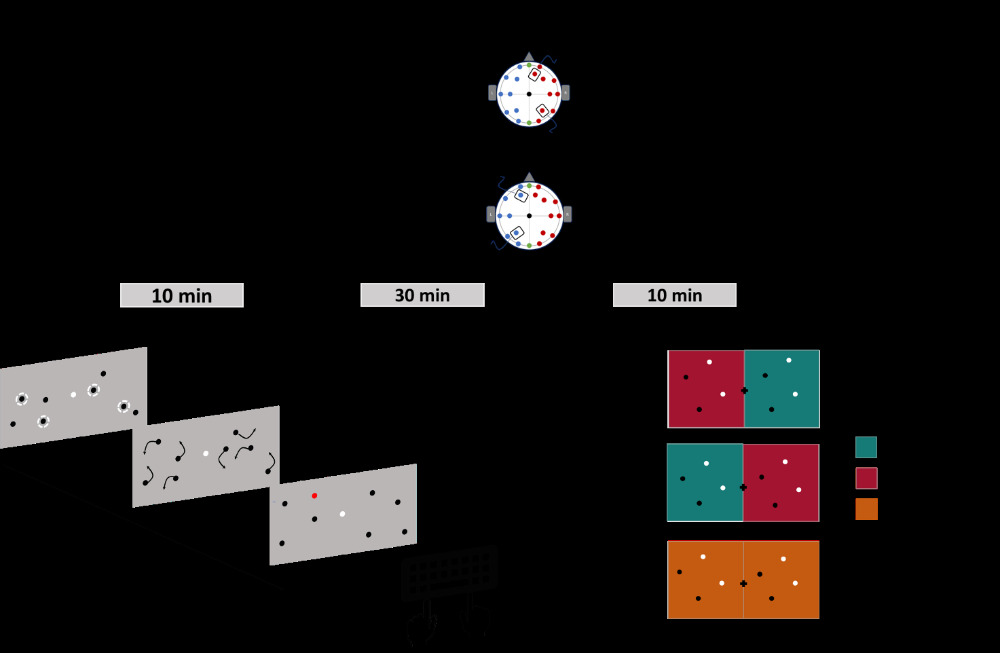
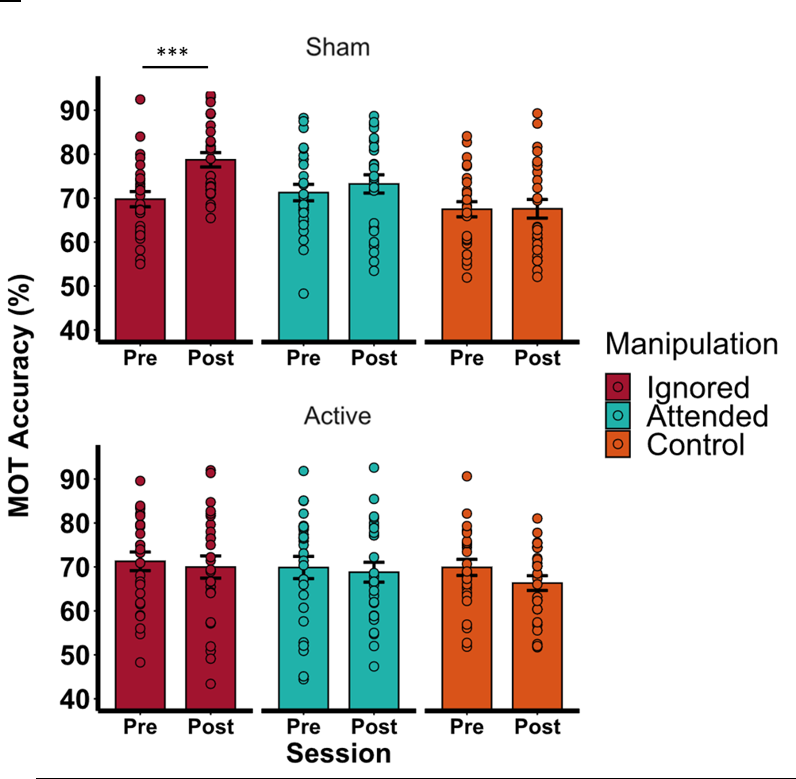
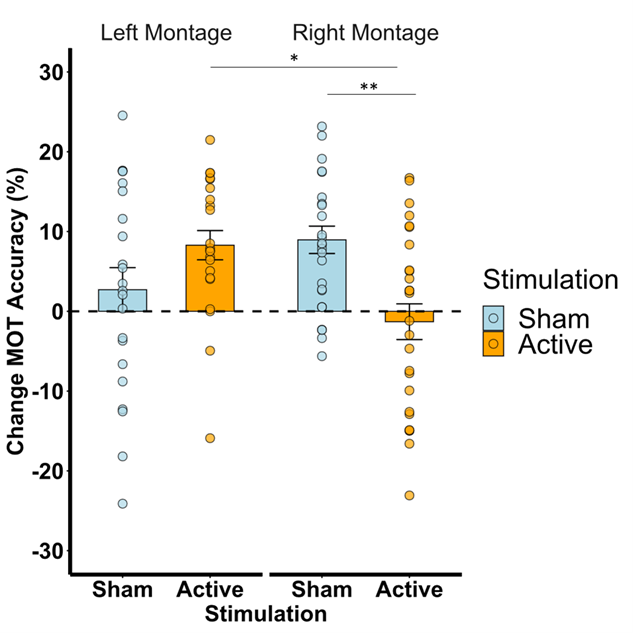
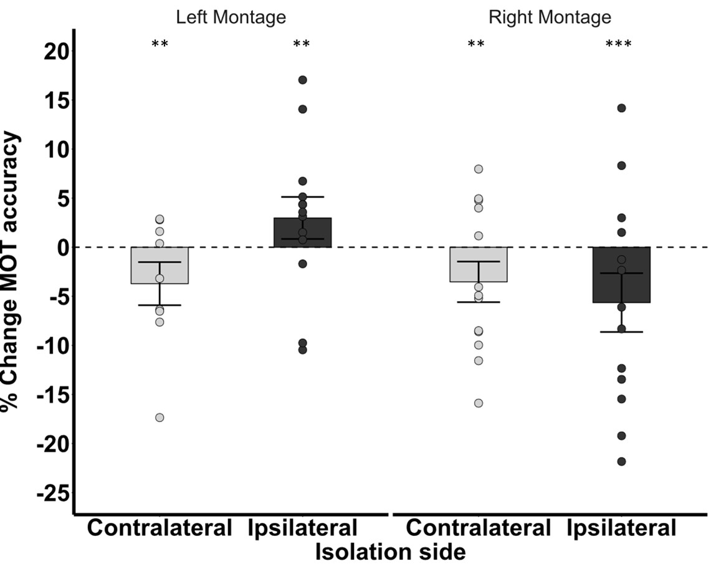

# Measuring how people reallocate attention — a mixed-model analysis of a 30-minute A/B experiment

**Companion repository to Tosi et al. (2026),** *Journal of Cognitive Neuroscience.*
📄 [Full paper (PDF)](paper/Tosi_et_al_JCN_revised.pdf) · [Supplementary material](paper/Supplementary_article.pdf)

---

## Why this repository might be interesting outside academia

Every experiment in this repo is built the same way a modern product experimentation team would run one:

- **Randomised assignment** of ~65 participants to three conditions (two "treatment" arms and a control).
- **Repeated measurements** on the same person across a Pre / During / Post timeline — so we can watch behaviour change *within* a subject, not just across groups.
- **A crossover manipulation** (each participant does both a real and a sham session, at least a week apart) — the same logic as a within-user A/B test where every user sees both variants.
- **A behavioural outcome** (accuracy on a moving-target tracking task) recorded at the **single-trial level** — roughly 500+ decisions per person, per session.

The core question — *does exposure to condition X change how people behave later?* — is the same question a Quantitative UX Analyst, an Insights Specialist or a Behavioural Scientist asks every week: does a new onboarding flow change retention, does a nudge change conversion, does a UI change trust ratings?

The statistical toolkit is the same too:

- **Generalised Linear Mixed-Effects Models (GLMMs)** on Bernoulli trial-level outcomes, with by-subject random intercepts and random slopes. This is the correct model whenever you have (i) repeated measurements per user and (ii) a binary or count-like outcome — clicks, conversions, task successes, comprehension checks, opt-outs. Ignoring the "same user was measured many times" structure gives you inflated Type-I error and confident-but-wrong conclusions.
- **Multi-way interactions** (`Session × Condition × Treatment`) to isolate *when* and *for whom* an effect appears, not just whether it exists on average.
- **Holm-corrected post-hoc contrasts** via `emmeans` to control false-positive inflation once you start slicing the data.
- **Effect sizes** (odds ratios, Cohen's *d*) reported alongside p-values, because the practical question is always "how big" — not just "is it real".
- **Model comparison** (likelihood-ratio tests over candidate random-effect structures) before locking in the reporting model.
- **A pre-registered outlier rule** (1.5 × IQR at baseline) applied before any inferential step.

That is the modelling stack behind any credible causal claim about individual and group behaviour — inside a lab or inside a product team.

---

## What the experiment actually did

Participants tracked moving dots on a screen (Multiple Object Tracking, MOT — a canonical measure of sustained visuospatial attention). For 30 minutes they focused only on one side of the screen (their "attended" side), ignoring the other side. Before and after that manipulation, we measured tracking accuracy on both sides.

Half of them received real electrical brain stimulation over the frontoparietal cortex during the 30 minutes; half received a sham. In one experiment (n = 39) the stimulation was on the right hemisphere; in a second (n = 26) on the left. Same task, same design, only the treatment site changed.

<p align="center">
  
  <br><em>Figure 1 — Timeline of a session, MOT trial structure, and the three between-subject groups (unilateral-left / unilateral-right / bilateral control).</em>
</p>

---

## The three findings, in plain language

**1. Ignoring a side of the screen for 30 minutes makes you *better* at it afterwards.**
Accuracy on the previously ignored side went *up* at post-test — a homeostatic rebound. Nothing surprising happens on the side you had been attending, and nothing happens in the control group (which tracked both sides equally). So the gain is specifically caused by the imbalance we imposed.

<p align="center">
  
  <br><em>Figure 2 — Pre vs Post tracking accuracy per condition, right-hemisphere experiment. The blue "Ignored" bar in the sham panel goes up. The active (real stimulation) panel does not.</em>
</p>

**2. Right-hemisphere stimulation kills the effect. Left-hemisphere stimulation preserves it.**
This is the paper's headline result. The same manipulation, delivered under two different treatments, produces two different outcomes. That is a *dissociation* — evidence that the two hemispheres play different causal roles in reallocating attention.

<p align="center">
  
  <br><em>Figure 4 — Pre-to-post gain (Δ MOT accuracy) in the previously ignored visual field. Right-hemisphere active tRNS abolishes the gain; left-hemisphere tRNS does not.</em>
</p>

**3. During the 30-minute manipulation, the two hemispheres behave in opposite ways.**
Right stimulation hurts tracking on both sides. Left stimulation improves the ipsilateral side and hurts the contralateral side — a classic contralateral bias that the right hemisphere doesn't show.

<p align="center">
  
  <br><em>Figure 5 — Change in MOT accuracy (active − sham) during the manipulation, split by whether the tracked side was ipsi- or contralateral to the stimulation. The pattern is qualitatively different across montages.</em>
</p>

---

## How to reproduce the analysis

### Repository layout

```
tRNS-attentional-isolation/
├── paper/                        Published PDF + supplementary
├── figures/                      Paper figures (PNG for the README, TIF for print)
├── preprocessing/                Python — from raw PsychoPy .txt logs to clean CSVs
│   ├── 01_build_pre_post_dataset.py
│   ├── 02_build_manipulation_dataset.py
│   └── 03_trial_counts.py
├── analysis/                     R Markdown — models and figures
│   ├── 01_glmer_pipeline.Rmd
│   └── 02_plotting.Rmd
├── requirements/
│   ├── requirements.txt          pip
│   └── R_packages.R              installer for the R stack
├── LICENSE
└── README.md
```

### Steps

1. **Set up.**
   Install the Python and R stacks:
   ```bash
   pip install -r requirements/requirements.txt
   Rscript requirements/R_packages.R
   ```
2. **Point the scripts at your raw data.**
   Open the two files in `preprocessing/` and set `RAW_ROOT` to the folder that contains the raw PsychoPy `.txt` logs (organised as `data/<subject>/<Sham|Active>/<session_folder>/*.txt`). Set `OUT_ROOT` to wherever you want the clean datasets to land.
3. **Build the clean datasets.**
   ```bash
   python preprocessing/01_build_pre_post_dataset.py
   python preprocessing/02_build_manipulation_dataset.py
   python preprocessing/03_trial_counts.py
   ```
4. **Run the models.** Open `analysis/01_glmer_pipeline.Rmd` in RStudio (adjust `DERIV` to point at the derivatives folder from step 2) and knit.
5. **Reproduce the figures.** Same for `analysis/02_plotting.Rmd`.

Raw data are not shared in this repository (ethics committee approval covers analysis by the authors and controlled sharing on request). Everything necessary to rerun the pipeline once you have the source `.txt` logs is here.

---

## A tour of the core model

The single most important line in the analysis is this GLMM, on trial-level correct/incorrect responses:

```r
glmer(
  Response ~ Session * Manipulation * Stimulation + (1 + VisualF | Subject),
  family  = binomial,
  data    = dt_filt
)
```

Read from left to right:

- `Response ~ ...` — we predict the outcome of every single trial (1 = tracked correctly, 0 = missed).
- `Session * Manipulation * Stimulation` — the full three-way interaction. This is where the science happens: does the effect of the treatment depend on both which group you're in *and* when in the timeline we're looking?
- `(1 + VisualF | Subject)` — the random-effects structure. Each participant gets their own baseline accuracy (random intercept) *and* their own left-vs-right asymmetry (random slope on `VisualF`). This is what "modelling individual differences correctly" looks like — and what a `t.test` or a plain `glm` would silently get wrong.
- `family = binomial` — the outcome is Bernoulli, so we're on a logit scale. Coefficients turn into odds ratios; `emmeans` then gives us the pairwise contrasts on the response scale.

The same recipe carries over to any product-analytics setting where you have repeated Bernoulli trials per user under different conditions. Swap `Response` for `converted`, `Session` for `week`, `Stimulation` for `variant`, and you have exactly the model you would want for a properly-analysed A/B test with within-user structure.

---

## Contact

Michele Tosi — [LinkedIn](https://www.linkedin.com/in/michele-tosi-cog/) · [Google Scholar](https://scholar.google.com/)
